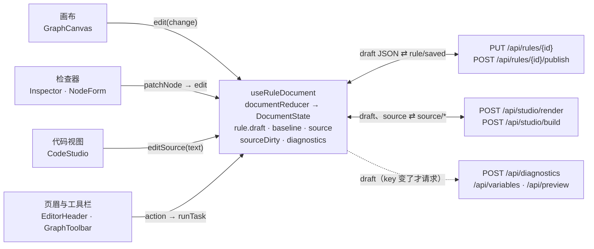
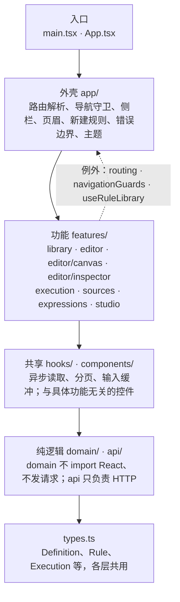
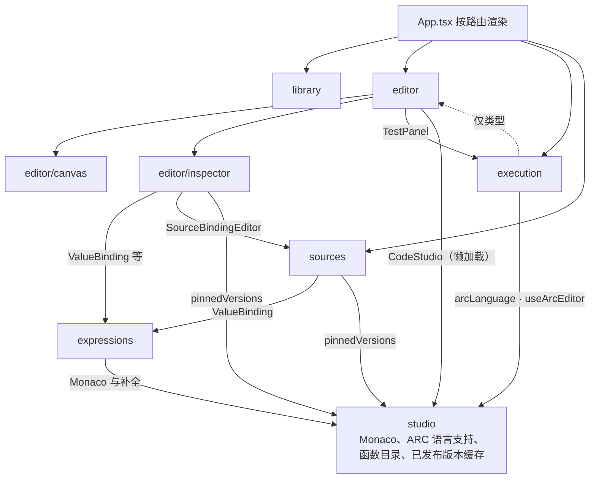

# ARC 前端地图

这份导读帮你读懂 `frontend/src` 的代码。顺序是：先建立整体印象（一份草稿、分层），再对照界面和功能找到入口，然后跟着关键流程读代码，最后用文件索引查任何一个文件。

模块边界和扩展规则以 [maintaining.md](maintaining.md) 和 [`check_architecture.py`](../scripts/check_architecture.py) 为准，这里只解释代码怎么组织、从哪里读起。链接指向文件，并写出要找的函数或组件名；在文件里搜这个名字就能定位。文件索引对应 2026-09-30 的代码，增删或改名文件时请一起更新。

## 一份草稿，多个视图

打开一条规则后，前端只有一份草稿 `rule.draft`，就是后端存储和执行的那个 Definition JSON。规则编辑器的核心是 [`useRuleDocument`](../frontend/src/features/editor/useRuleDocument.ts)：它用 `useReducer` 持有 `DocumentState`，画布、检查器、代码视图只负责显示这份状态，并把用户操作变成 action。



图里省略了读取方向：每个视图都从 `DocumentState` 读取它要显示的内容（画布读 `rule.draft`，检查器读选中的节点，代码视图读 `source`，按钮读 `capabilities`）。打开规则时，[`App`](../frontend/src/App.tsx) 先 `GET /api/rules/{id}`，再交给 `initialDocument` 建立初始状态。保存和代码视图的请求结果作为 action（`rule/saved`、`source/*`）回到 reducer；虚线的诊断、变量、测试运行是从草稿派生的读取，结果交给 `useGraphProblems`、`useNodeVariables`、`usePreviewExecution`，不写回草稿。

记住三件事：

- **所有编辑都是 `edit(change)`。** 拖动卡片、连线、改字段、删节点，最后都是一个 `(draft) => draft` 纯函数，交给 [`edit`](../frontend/src/features/editor/useRuleDocument.ts)，变成 reducer 的 `graph/change`。
- **命令一次只跑一个。** 保存、发布、校验、构建、排版、测试、删除都经过 [`runTask`](../frontend/src/features/editor/useRuleDocument.ts) 的命令锁；按钮能不能点来自 [`editorCapabilities`](../frontend/src/features/editor/editorCapabilities.ts)。
- **派生读取按 key 触发。** 诊断和测试结果以“去掉坐标的草稿”为 key，变量以“只含结构的草稿”为 key，所以拖动卡片不会引起任何请求。

## 分层与依赖

import 只往下走：



上层可以 import 任何下层，反过来不行。唯一的例外是虚线：features 会 import `app/` 里的三个文件，两个导航基础设施（[`routing.ts`](../frontend/src/app/routing.ts)、[`navigationGuards.ts`](../frontend/src/app/navigationGuards.ts)）和规则库的目录状态（[`useRuleLibrary.ts`](../frontend/src/app/useRuleLibrary.ts)，它由 App 持有）。样式表 `styles/` 只由 `main.tsx` 通过 `index.css` 引入一次。

[`check_architecture.py`](../scripts/check_architecture.py) 在 CI 里检查这些规则，违反就失败：

- `domain/` 只能 import `types.ts` 和 `domain/` 自己的文件：不能用 React、MUI、React Flow，也不能发请求。所以它的函数都能在 Node 里直接做单元测试。
- `api/` 只能 import `types.ts`、`api/` 和 `domain/json`。
- `components/` 不能 import `features/`、`app/`、`api/`：通用控件不认识任何功能。
- features 里另有 16 个文件也按纯模块检查，例如 `documentState.ts`、`editorCapabilities.ts`、`edgeRouting.ts`、`sourceDocument.ts`，以及 `app/routing.ts`。
- 除了 [`nodePorts.ts`](../frontend/src/domain/nodePorts.ts)，任何文件都不许手写连线句柄的字符串（`"true"`、`"default"`、`` `case:${id}` ``），要用 `handles` 和 `sourcePort`。

features 之间的依赖：



箭头 A → B 表示 A import B，虚线表示只 import 类型；canvas 反过来 import editor 的也只有类型，library 不 import 其他功能。`features/studio` 的名字来自 Code studio，但大部分是共享设施：检查器的表达式输入、测试面板的 JSON 编辑器、数据源绑定都在用。只属于代码视图的是 `CodeStudio.tsx`、`StudioLibrary.tsx`、`StudioOutline.tsx`、`StudioProblems.tsx` 和 `scriptOutline.ts`。

每条箭头具体 import 的文件：

| 从 | 到 | import 的文件 |
| --- | --- | --- |
| editor | editor/canvas | GraphCanvas.tsx、useGraphCanvas.ts、useGraphCommands.ts、useGraphFocus.ts |
| editor | editor/inspector | Inspector.tsx、NodeForm.tsx、NodeIdentity.tsx |
| editor | execution | TestPanel.tsx、useExecutionRequest.ts、useInputBuffer.ts、useExecutionOptions.ts |
| editor | studio | CodeStudio.tsx（懒加载）、useArcEditor.ts、useArcLanguageSupport.ts、useFormulaSupport.ts、useFunctionCatalog.ts、FunctionLibrary.tsx、ExpressionColorKey.tsx |
| editor/canvas | editor | 仅类型：useRuleDocument.ts、editorCapabilities.ts、useGraphProblems.ts |
| editor/inspector | expressions | ValueBinding.tsx、ExpressionField.tsx、ExpressionDialogButton.tsx、UndeclaredBindings.tsx、useEditingPin.ts |
| editor/inspector | sources | SourceBindingEditor.tsx |
| editor/inspector | studio | pinnedVersions.ts |
| execution | editor | 仅类型：types.ts、usePreviewExecution.ts |
| execution | studio | arcLanguage.ts、useArcEditor.ts |
| expressions | studio | useArcEditor.ts、useArcLanguageSupport.ts、useFormulaSupport.ts、useFunctionCatalog.ts、FunctionLibrary.tsx、ExpressionColorKey.tsx |
| sources | expressions | ValueBinding.tsx、UndeclaredBindings.tsx |
| sources | studio | pinnedVersions.ts |
| App.tsx | studio | formulaMetadata.ts、pinnedVersions.ts（删除规则后清掉缓存） |

## 界面上的组件

打开一条规则的 graph 视图时，屏幕上每一块由哪个文件画出来：

```text
+---------+--------------------------------------------------------------+
|         | WorkspaceHeader (breadcrumb)                                 |
|         +--------------------------------------------------------------+
|         | EditorHeader: settings, rule name, Draft / Version N         |
|         |   Code editor, History, Test rule, Save draft, Publish       |
| Sidebar +--------------------------------------+-----------------------+
|         | GraphToolbar: outline, arrange,      | Inspector             |
|         |   export, Validate, Add node         |   NodeIdentity        |
|         +--------------------------------------+   NodeForm            |
|         | GraphCanvas -> <ReactFlow>           |     <Kind>Fields      |
|         |   cards: GraphNode                   |     ValueBinding      |
|         |   connections: RoutedEdge            |     ResultFields      |
|         |   Controls, MiniMap                  |     UnusedProperties  |
|         +--------------------------------------+                       |
|         | TestPanel (features/execution)       |                       |
|         +--------------------------------------+                       |
|         | status bar (inside GraphCanvas)      |                       |
+---------+--------------------------------------+-----------------------+
```

| 区域 | 文件 | 说明 |
| --- | --- | --- |
| 侧栏、面包屑 | [`Sidebar`](../frontend/src/app/Sidebar.tsx)、[`WorkspaceHeader`](../frontend/src/app/WorkspaceHeader.tsx) | 属于应用外壳，所有页面共用 |
| 编辑器页眉 | [`EditorHeader`](../frontend/src/features/editor/EditorHeader.tsx) | 视图切换、版本历史、测试、保存、发布；按钮是否可用读 `capabilities` |
| 画布工具栏 | [`GraphToolbar`](../frontend/src/features/editor/canvas/GraphToolbar.tsx) | 大纲、排版、导出 JSON、校验、添加节点 |
| 画布 | [`GraphCanvas`](../frontend/src/features/editor/canvas/GraphCanvas.tsx) | `<ReactFlow>`、右键菜单、小地图、状态栏 |
| 卡片、连线 | [`GraphNode`](../frontend/src/features/editor/canvas/GraphNode.tsx)、[`RoutedEdge`](../frontend/src/features/editor/canvas/RoutedEdge.tsx) | 卡片显示节点类型、名称、摘要、错误和出口；连线绕开卡片走直角 |
| 测试面板 | [`TestPanel`](../frontend/src/features/execution/TestPanel.tsx) | 输入 JSON、运行、结果和 trace |
| 检查器 | [`Inspector`](../frontend/src/features/editor/inspector/Inspector.tsx) | 节点名、错误、代码和删除按钮，以及按类型选出的表单 |

切到代码视图（`#/studio/<id>`）时，画布和检查器换成 [`CodeStudio`](../frontend/src/features/studio/CodeStudio.tsx)，页眉和测试面板保留。图里没画的弹出层：节点编辑（右键 Edit，`NodeEditDialog`）、节点代码（卡片或检查器上的代码按钮，`NodeExpressionDialog`）、规则设置（`RuleSettings`）、版本历史（`VersionHistory`）、被引用的规则（`ReferenceDialog`）、表达式对话框（`ExpressionDialog`）、数据源管理（`SourceManagerDialog`）。

## 按功能找代码

每个功能从哪里进入、先读哪几个文件、状态放在哪、调用哪些接口、哪些测试描述它的行为。

### 规则库

- **入口**：`#/library` → [`LibraryPage.tsx`](../frontend/src/features/library/LibraryPage.tsx)。目录状态 [`useRuleLibrary`](../frontend/src/app/useRuleLibrary.ts) 放在 App 里，离开规则库再回来，搜索词和页码都还在。
- **先读**：[`useRuleLibrary`](../frontend/src/app/useRuleLibrary.ts)（防抖搜索和分页）→ [`Library`](../frontend/src/features/library/LibraryPage.tsx)（页面组件，卡片网格）→ [`RuleCard`](../frontend/src/features/library/RuleCard.tsx)（读取完整规则画缩略图，带缓存和重试）→ [`rulePreview`](../frontend/src/domain/rulePreview.ts)（缩略图的分层布局，纯函数）。
- **状态**：保存或新建规则后，目录标记为过期，下次显示时重载。缩略图缓存在 [`previewCache.ts`](../frontend/src/features/library/previewCache.ts)，按“规则化身 + revision”存 40 条；打开规则时 App 会重新读取，不用这份缓存。
- **接口**：`GET /api/rule-summaries`（目录的一页）、`GET /api/rules/{id}`（每张卡片的缩略图）、`POST /api/rules`（新建规则）。
- **测试**：[library-overview.spec.ts](../frontend/tests/library-overview.spec.ts)、[catalog-pagination.spec.ts](../frontend/tests/catalog-pagination.spec.ts)、[create-rule.spec.ts](../frontend/tests/create-rule.spec.ts)、[library-previews.spec.ts](../frontend/tests/unit/library-previews.spec.ts)、[rule-preview.spec.ts](../frontend/tests/unit/rule-preview.spec.ts)。

### 画布编辑

- **入口**：`#/rules/<id>` → [`EditorRoute.ts`](../frontend/src/app/EditorRoute.ts)（懒加载，带上 React Flow）→ [`Editor.tsx`](../frontend/src/features/editor/Editor.tsx)。加 `?version=N` 打开只读的已发布版本，加 `&node=<节点 ID>` 聚焦一个节点。
- **先读**：[`useRuleDocument`](../frontend/src/features/editor/useRuleDocument.ts)（草稿、命令锁、保存发布、视图切换）→ [`documentReducer`](../frontend/src/features/editor/documentState.ts)（9 个 action）→ [`useGraphCanvas`](../frontend/src/features/editor/canvas/useGraphCanvas.ts)（草稿 → React Flow 元素）→ [`useGraphCommands`](../frontend/src/features/editor/canvas/useGraphCommands.ts)（修改、添加、删除节点，排版）。
- **状态**：草稿在 `DocumentState`；选中项在 [`useNodeSelection`](../frontend/src/features/editor/useNodeSelection.ts)，总是从草稿推导；卡片的实测尺寸在 `useGraphCanvas`，从不写进草稿；测试会话在 `usePreviewExecution`。
- **接口**：`GET /api/rules/{id}`（打开，由 App 发起）、`GET /api/rules/{id}/versions/{v}`（历史版本）、`PUT /api/rules/{id}` 和 `POST /api/rules/{id}/publish`（保存、发布）、`POST /api/validate`、`POST /api/diagnostics`（校验、实时诊断）、`DELETE /api/rules/{id}?revision=N`（删除规则）。
- **测试**：[graph-authoring.spec.ts](../frontend/tests/graph-authoring.spec.ts)、[editor.spec.ts](../frontend/tests/editor.spec.ts)、[editor-commands.spec.ts](../frontend/tests/editor-commands.spec.ts)、[editor-capabilities.spec.ts](../frontend/tests/editor-capabilities.spec.ts)、[layout.spec.ts](../frontend/tests/layout.spec.ts)、[routing.spec.ts](../frontend/tests/routing.spec.ts)（连线避障，不是页面路由）、[node-context-menu.spec.ts](../frontend/tests/node-context-menu.spec.ts)、[edge-context-menu.spec.ts](../frontend/tests/edge-context-menu.spec.ts)、[canvas-render-cost.spec.ts](../frontend/tests/canvas-render-cost.spec.ts)、[rule-session.spec.ts](../frontend/tests/rule-session.spec.ts)、[rule-delete.spec.ts](../frontend/tests/rule-delete.spec.ts)，单元测试 [document.spec.ts](../frontend/tests/unit/document.spec.ts)、[canvas.spec.ts](../frontend/tests/unit/canvas.spec.ts)、[graph-nodes.spec.ts](../frontend/tests/unit/graph-nodes.spec.ts)、[graph-layout.spec.ts](../frontend/tests/unit/graph-layout.spec.ts)。

### 检查器

- **入口**：graph 视图右栏的 [`Inspector`](../frontend/src/features/editor/inspector/Inspector.tsx)。节点编辑对话框（右键 Edit）复用同一个 `NodeForm`，只是改的是草稿副本，Apply 时再合并回去。
- **先读**：[`fieldsByType`](../frontend/src/features/editor/inspector/NodeForm.tsx)（按节点类型分发表单的注册表）→ [`FormulaFields`](../frontend/src/features/editor/inspector/FormulaFields.tsx)（最简单的一个表单）→ [`ValueBinding`](../frontend/src/features/expressions/ValueBinding.tsx)（变量、常量、表达式三种取值方式）→ [`useNodeVariables`](../frontend/src/features/editor/inspector/useNodeVariables.ts)（这个节点能用哪些变量）。
- **状态**：表单不自己存规则数据，改动直接 `patchNode` → `edit`。只有正在输入、还不合法的文本（JSON、数字默认值）留在控件里，并通过 `onInvalidDefault` 阻止保存和切换。
- **接口**：`POST /api/variables`（按 scopeGraphKey 读取）、`POST /api/studio/expression/check`（表达式对话框的检查）、`GET /api/functions`（函数目录，全页只读一次）、`GET /api/rule-summaries` 和 `GET /api/rules/{id}/version-summaries`（Reference 节点选规则和版本）。
- **测试**：[inspector-sections.spec.ts](../frontend/tests/inspector-sections.spec.ts)、[inspector-header.spec.ts](../frontend/tests/inspector-header.spec.ts)、[condition-builder.spec.ts](../frontend/tests/condition-builder.spec.ts)、[switch-values.spec.ts](../frontend/tests/switch-values.spec.ts)、[value-binding-editing.spec.ts](../frontend/tests/value-binding-editing.spec.ts)、[value-binding-types.spec.ts](../frontend/tests/value-binding-types.spec.ts)、[reference-picker.spec.ts](../frontend/tests/reference-picker.spec.ts)、[available-variables.spec.ts](../frontend/tests/available-variables.spec.ts)、[node-names.spec.ts](../frontend/tests/node-names.spec.ts)、[json-defaults.spec.ts](../frontend/tests/json-defaults.spec.ts)、[numeric-defaults.spec.ts](../frontend/tests/numeric-defaults.spec.ts)，单元测试 [node-form.spec.ts](../frontend/tests/unit/node-form.spec.ts)、[inspector-variables.spec.ts](../frontend/tests/unit/inspector-variables.spec.ts)、[value-binding.spec.ts](../frontend/tests/unit/value-binding.spec.ts)。

### 代码视图

- **入口**：`#/studio/<id>` 还是同一个 Editor 会话，只是 mode 变成 `"code"`；[`Editor`](../frontend/src/features/editor/Editor.tsx) 懒加载 [`CodeStudio`](../frontend/src/features/studio/CodeStudio.tsx) 和 Monaco。前端不解析 ARC Script，渲染和解析都在后端。
- **先读**：[`useRuleDocument`](../frontend/src/features/editor/useRuleDocument.ts) 里进入代码视图时的渲染 effect 和 [`buildCode`](../frontend/src/features/editor/useRuleDocument.ts) → [`CodeStudio`](../frontend/src/features/studio/CodeStudio.tsx) → [`adoptSource`](../frontend/src/features/studio/useArcEditor.ts)（Monaco 跟随文档，保留光标和撤销）→ [`useArcLanguageSupport`](../frontend/src/features/studio/useArcLanguageSupport.ts)（补全、悬停、语义着色）。
- **状态**：文本在 `DocumentState.source`；`sourceDirty` 表示改过但还没构建，这时保存、测试、切回画布之前都会先构建。Monaco 是非受控的，规范化后的文本用 `adoptSource` 只替换变化的部分。
- **接口**：`POST /api/studio/render`（草稿 → 文本）、`POST /api/studio/build`（文本 → 草稿和诊断）、`GET /api/functions`、`GET /api/rule-summaries` 和 `GET /api/rules/{id}/versions/{v}`（Reuse 面板和 `@` 公式）。
- **测试**：[studio.spec.ts](../frontend/tests/studio.spec.ts)、[studio-outline.spec.ts](../frontend/tests/studio-outline.spec.ts)、[studio-reuse.spec.ts](../frontend/tests/studio-reuse.spec.ts)、[studio-refactor.spec.ts](../frontend/tests/studio-refactor.spec.ts)、[formula-calls.spec.ts](../frontend/tests/formula-calls.spec.ts)、[formula-completion.spec.ts](../frontend/tests/formula-completion.spec.ts)、[editor-language-context.spec.ts](../frontend/tests/editor-language-context.spec.ts)、[expression-colors.spec.ts](../frontend/tests/expression-colors.spec.ts)、[function-namespace.spec.ts](../frontend/tests/function-namespace.spec.ts)，单元测试 [studio-snippets.spec.ts](../frontend/tests/unit/studio-snippets.spec.ts)、[studio-outline.spec.ts](../frontend/tests/unit/studio-outline.spec.ts)、[formula-metadata.spec.ts](../frontend/tests/unit/formula-metadata.spec.ts)、[expression-symbols.spec.ts](../frontend/tests/unit/expression-symbols.spec.ts)。

### 测试面板

- **入口**：页眉的 Test rule → [`toggleTest`](../frontend/src/features/editor/useRuleDocument.ts)。面板 [`TestPanel`](../frontend/src/features/execution/TestPanel.tsx) 在画布下方；代码视图里也有同一个面板。
- **先读**：[`usePreviewExecution`](../frontend/src/features/editor/usePreviewExecution.ts)（测试会话和请求 key）→ [`useExecutionRequest`](../frontend/src/features/execution/useExecutionRequest.ts)（key 一变就中止旧请求）→ [`ExecutionResult`](../frontend/src/features/execution/ExecutionResult.tsx)（返回值、耗时、trace 步骤）→ [`takenBranches`](../frontend/src/features/editor/canvas/flowElements.ts)（画布上高亮走过的出口）。
- **状态**：`usePreviewExecution` 在 Editor 里、视图切换之上，所以切到代码视图再回来，输入和结果都还在。请求 key 是 `[semanticGraphKey, 输入, 选项]`，拖动卡片不影响它。
- **接口**：`POST /api/preview`（发送当前草稿和输入，返回结果和 trace）。
- **测试**：[preview-session.spec.ts](../frontend/tests/preview-session.spec.ts)、[execution-lifecycle.spec.ts](../frontend/tests/execution-lifecycle.spec.ts)、[execution-json-editor.spec.ts](../frontend/tests/execution-json-editor.spec.ts)、[execution-result-display.spec.ts](../frontend/tests/execution-result-display.spec.ts)、[output-preview.spec.ts](../frontend/tests/output-preview.spec.ts)，单元测试 [execution.spec.ts](../frontend/tests/unit/execution.spec.ts)、[execution-error.spec.ts](../frontend/tests/unit/execution-error.spec.ts)、[trace-badges.spec.ts](../frontend/tests/unit/trace-badges.spec.ts)、[input-buffer.spec.ts](../frontend/tests/unit/input-buffer.spec.ts)。

### API Playground

- **入口**：`#/playground` 和 `#/docs` 都渲染 [`ApiPage`](../frontend/src/features/execution/ApiPage.tsx)：选一个已发布规则和版本，编辑输入，调用真正的执行接口。
- **先读**：[`ApiPage`](../frontend/src/features/execution/ApiPage.tsx) → [`usePublishedExecution`](../frontend/src/features/execution/usePublishedExecution.ts)（页面的控制器；执行请求和测试面板用同一个 `useExecutionRequest`）→ [`publishedSelection.ts`](../frontend/src/features/execution/publishedSelection.ts)（选规则和最新版本的纯函数）→ [`publishedCurl`](../frontend/src/features/execution/publishedCurl.ts)（生成可复制的 cURL）。
- **状态**：`usePublishedExecution` 持有已发布目录、版本历史、输入缓冲和执行结果。页面直接显示原始响应 JSON，不用测试面板的 `ExecutionResult`。
- **接口**：`GET /api/rule-summaries`（只列已发布的规则）、`GET /api/rules/{id}/version-summaries`（版本历史）、`GET /api/rules/{id}/versions/{v}`（版本的 definition，用来生成示例输入）、`POST /api/rules/{id}/execute`（执行）。
- **测试**：[execution-catalog.spec.ts](../frontend/tests/execution-catalog.spec.ts)、[arc.spec.ts](../frontend/tests/arc.spec.ts)，单元测试 [published-selection.spec.ts](../frontend/tests/unit/published-selection.spec.ts)。

### 数据源

- **入口**：`#/sources` → [`SourcesPage`](../frontend/src/features/sources/SourcesPage.tsx)。规则编辑器里，输入参数卡片用 [`SourceBindingEditor`](../frontend/src/features/sources/SourceBindingEditor.tsx) 绑定数据源，并从那里懒加载数据源管理对话框。
- **先读**：[`useSourceEditor`](../frontend/src/features/sources/useSourceEditor.ts)（控制器：目录、选择、保存、测试）→ [`sourceDocumentReducer`](../frontend/src/features/sources/sourceDocument.ts)（纯状态，和 `documentState.ts` 同一种写法）→ [`sourceProviders`](../frontend/src/features/sources/sourceProviders.ts)（LOOKUP、HTTP 两种提供者的描述表）→ [`SourceBindingEditor`](../frontend/src/features/sources/SourceBindingEditor.tsx)（检查器里的绑定）。
- **状态**：数据源文档由 `sourceDocumentReducer` 管理。编辑器里的管理对话框自带一个 `useSourceEditor`，和规则的脏状态分开；有未保存的修改或保存进行中时不能关闭。
- **接口**：`GET /api/source-summaries`（目录）、`GET /api/sources/{id}/versions/{v}`（某个版本的配置）、`POST /api/sources` 和 `PUT /api/sources/{id}`（新建、保存为新版本）、`POST /api/sources/{id}/test`（用示例参数取一次数据）。
- **测试**：[source-editor.spec.ts](../frontend/tests/source-editor.spec.ts)、[source-provider.spec.ts](../frontend/tests/source-provider.spec.ts)、[source-binding-names.spec.ts](../frontend/tests/source-binding-names.spec.ts)、[workspace-navigation.spec.ts](../frontend/tests/workspace-navigation.spec.ts)，单元测试 [source-document.spec.ts](../frontend/tests/unit/source-document.spec.ts)、[source-providers.spec.ts](../frontend/tests/unit/source-providers.spec.ts)、[source-bindings.spec.ts](../frontend/tests/unit/source-bindings.spec.ts)、[source-catalog.spec.ts](../frontend/tests/unit/source-catalog.spec.ts)。

### 应用外壳

- **入口**：[`main.tsx`](../frontend/src/main.tsx) 挂载主题和根错误边界 → [`App`](../frontend/src/App.tsx) 按路由渲染页面。所有路由都是哈希路由：

  | 路由 | 页面 |
  | --- | --- |
  | `#/library` | 规则库；空路由和未知路径也显示它 |
  | `#/rules/<id>`、`#/studio/<id>` | 同一条规则的画布和代码视图 |
  | `?version=N&node=<节点 ID>` | 只读的已发布版本、聚焦的节点 |
  | `#/sources` | 数据源 |
  | `#/playground`、`#/docs` | API Playground 和文档 |

- **先读**：[`parseRoute`](../frontend/src/app/routing.ts)（路由字符串 → `WorkspaceRoute`）→ [`useWorkspaceNavigation`](../frontend/src/app/useWorkspaceNavigation.ts)（唯一修改 `location.hash` 的地方）→ [`useNavigationGuard`](../frontend/src/app/navigationGuards.ts)（离开前需要确认的工作）→ [`LazyBoundary`](../frontend/src/components/LazyBoundary.tsx)（懒加载加局部错误边界）。
- **状态**：App 持有路由、规则库状态、选中规则的读取、刚保存的副本 `savedRule` 和通知。编辑器会话的 key 是“规则 ID:版本”，所以在画布和代码视图之间切换不会重新挂载编辑器。
- **接口**：`GET /api/rules/{id}`（选中的规则）。`/api` 在开发时由 Vite 代理，生产由 nginx 代理。
- **测试**：[workspace-navigation.spec.ts](../frontend/tests/workspace-navigation.spec.ts)、[app-resilience.spec.ts](../frontend/tests/app-resilience.spec.ts)、[unreadable-response.spec.ts](../frontend/tests/unreadable-response.spec.ts)、[insecure-origin.spec.ts](../frontend/tests/insecure-origin.spec.ts)，单元测试 [workspace-routing.spec.ts](../frontend/tests/unit/workspace-routing.spec.ts)、[navigation-guards.spec.ts](../frontend/tests/unit/navigation-guards.spec.ts)、[http.spec.ts](../frontend/tests/unit/http.spec.ts)、[async-resource.spec.ts](../frontend/tests/unit/async-resource.spec.ts)。

## 数据模型

[`Definition`](../frontend/src/types.ts) 就是后端存储、执行、校验的那个 JSON，前端所有界面都从它派生。

### JSON 字段在界面上的样子

| Definition 里的字段 | 在界面上 | 由谁处理 |
| --- | --- | --- |
| `nodes[]` | 画布上的一张卡片 | [`flowNodes`](../frontend/src/features/editor/canvas/flowElements.ts) → [`GraphNode`](../frontend/src/features/editor/canvas/GraphNode.tsx) |
| `node.type` | 卡片颜色和图标、检查器表单、有哪些出口 | [`nodeKinds`](../frontend/src/domain/nodeKinds.ts)、[`sourcePorts`](../frontend/src/domain/nodePorts.ts)、[`fieldsByType`](../frontend/src/features/editor/inspector/NodeForm.tsx) |
| `node.position` | 卡片位置；拖动卡片就是改它 | [`onNodesChange`](../frontend/src/features/editor/canvas/useGraphCanvas.ts) |
| `node.label` | 卡片标题、检查器顶部的名称 | `GraphNode`、[`NodeIdentity`](../frontend/src/features/editor/inspector/NodeIdentity.tsx) |
| `edges[]` | 一条连线 | [`flowEdges`](../frontend/src/features/editor/canvas/flowElements.ts) → [`RoutedEdge`](../frontend/src/features/editor/canvas/RoutedEdge.tsx) |
| `edge.sourceHandle` | 从哪个出口连出：`next`、`true`、`false`、`case:<id>`、`default` | [`sourcePort`](../frontend/src/domain/nodePorts.ts) |
| `inputs[]` | Input 节点检查器里的参数卡片 | [`InputFields`](../frontend/src/features/editor/inspector/InputFields.tsx)、[`InputParameterCard`](../frontend/src/features/editor/inspector/InputParameterCard.tsx) |
| `notes` | 只在代码视图里以 `//` 注释出现 | 后端渲染和解析 |

### 七种节点

每种节点的事实都写在 [`nodeKinds`](../frontend/src/domain/nodeKinds.ts) 描述表里；新增一种节点时，编译器会要求每一项都填上。

| 类型 | 界面名 | 出口（sourceHandle） | 存结果 | 可被连入 | 可以设置的属性 | 检查器表单 |
| --- | --- | --- | --- | --- | --- | --- |
| `INPUT` | Input | `next` | 否 | 否 | 无（参数在 `inputs` 里） | `InputFields` |
| `FORMULA` | Formula | `next` | 是 | 是 | `expression`、`output` | `FormulaFields` |
| `CONDITION` | Condition | `true`、`false` | 否 | 是 | `expression` | `ConditionFields` |
| `SWITCH` | Switch | `case:<id>` …、`default` | 否 | 是 | `selector`、`cases` | `SwitchFields` |
| `TRANSFORM` | Transform | `next` | 是 | 是 | `fields` 或 `expression`、`output` | `TransformFields` |
| `REFERENCE` | Reuse rule | `next` | 是 | 是 | `ruleId` + `version`、`bindings`、`output` | `ReferenceFields` |
| `OUTPUT` | Output | 无 | 否 | 是 | `expression`、`outputName` | `OutputFields` |

“存结果”的节点（Formula、Transform、Reference）在检查器里多一个 `ResultFields`，结果名写进 `output`，下游表达式可以当变量读。Switch 的出口 ID 用分支的 `id` 而不是顺序，所以调整分支顺序不会断开连线。

### DocumentState 和它的 9 个 action

[`DocumentState`](../frontend/src/features/editor/documentState.ts) 有五个字段：

| 字段 | 含义 |
| --- | --- |
| `rule` | 规则的元数据和 `draft`（Definition） |
| `baseline` | 上次保存时的快照字符串（`ruleSnapshot`：名称、描述、草稿），和当前不同就是“有未保存的改动” |
| `source` | 代码视图的文本；`null` 表示还没渲染，或已被画布上的编辑作废 |
| `sourceDirty` | 文本改过但还没构建成草稿 |
| `diagnostics` | 最近一次代码构建的诊断（带行列） |

所有改动都是下面的 action 之一：

| action | 谁发出 | 做什么 |
| --- | --- | --- |
| `graph/change` | `edit(change)`：画布、检查器、节点对话框 | 用 change 算出新草稿，并把 `source` 清成 `null` |
| `graph/arranged` | 排版命令（ELK 算完） | 只在草稿还是排版开始时那个对象时才应用 |
| `version/loaded` | 打开 `?version=N` | 用这个已发布版本的 definition 替换草稿（只读） |
| `rule/metadata` | 规则设置对话框 | 修改名称和描述 |
| `rule/saved` | 保存或发布成功 | 推进 revision 和 baseline；请求期间的新编辑保留 |
| `source/changed` | 代码视图里打字 | 记下文本，`sourceDirty = true` |
| `source/rendered` | `/studio/render` 返回 | 只在 `source` 仍为 `null`、草稿没变时写入 |
| `source/built` | `/studio/build` 成功 | 用构建出的 definition 替换草稿，文本换成规范化后的版本 |
| `source/diagnostics` | `/studio/build` 返回 | 记下代码诊断（文本没变才写入） |

## 关键流程

### 打开一条规则，画出画布

1. [`parseRoute`](../frontend/src/app/routing.ts)：`#/rules/order-pricing` 被解析成 `{ page: "rule", mode: "graph", version: null }`。
2. [`App`](../frontend/src/App.tsx) 用 [`useAsyncResource`](../frontend/src/hooks/useAsyncResource.ts) 读取 `GET /api/rules/{id}`；如果刚保存过，用更新的 `savedRule` 代替。
3. App 用 `lazy(() => import("./app/EditorRoute"))`，第一次打开规则时才下载编辑器和 React Flow。外面的 `LazyBoundary` 以“规则 ID:版本”为 key，一个 key 就是一次编辑会话。
4. [`useRuleDocument`](../frontend/src/features/editor/useRuleDocument.ts) 调用 `useReducer(documentReducer, initial, initialDocument)`；[`initialDocument`](../frontend/src/features/editor/documentState.ts) 给缺坐标的节点补上坐标，记下 baseline，代码缓冲为 `null`。
5. [`Editor`](../frontend/src/features/editor/Editor.tsx) 把 `rule.draft` 交给 [`useGraphCanvas`](../frontend/src/features/editor/canvas/useGraphCanvas.ts)。
6. [`flowNodes`](../frontend/src/features/editor/canvas/flowElements.ts) 和 [`flowEdges`](../frontend/src/features/editor/canvas/flowElements.ts) 把 nodes、edges 转成 React Flow 元素；没有变化的节点直接复用上一次的对象。
7. [`GraphCanvas`](../frontend/src/features/editor/canvas/GraphCanvas.tsx) 渲染 `<ReactFlow>`，每张卡片由 [`GraphNode`](../frontend/src/features/editor/canvas/GraphNode.tsx) 画出；卡片的 `data.model` 就是原始的 RuleNode。

### 在检查器里改一个字段

1. [`useNodeSelection`](../frontend/src/features/editor/useNodeSelection.ts)：点卡片选中节点。选中的节点总是从当前草稿按 ID 找出来，不另存一份。
2. [`fieldsByType`](../frontend/src/features/editor/inspector/NodeForm.tsx)：NodeForm 按节点类型从注册表里取表单组件，例如 `FORMULA` → `FormulaFields`。
3. [`FormulaFields`](../frontend/src/features/editor/inspector/FormulaFields.tsx)：输入表达式时调用 `patch({ expression })`。
4. [`patchNode`](../frontend/src/features/editor/canvas/useGraphCommands.ts) 把它包成调用 [`patchGraphNode`](../frontend/src/domain/graph.ts) 的 DefinitionChange，交给 `edit`。
5. [`edit`](../frontend/src/features/editor/useRuleDocument.ts) 先检查现在能不能编辑（只读版本、有命令在跑都会拒绝），再派发 `graph/change`。
6. [`documentReducer`](../frontend/src/features/editor/documentState.ts) 算出新草稿，并清空代码缓冲。
7. 重新渲染时只有这张卡片的对象变了。诊断的 key（[`semanticGraphKey`](../frontend/src/domain/graph.ts)）变了，[`useGraphProblems`](../frontend/src/features/editor/useGraphProblems.ts) 稍后重新请求；变量的 key（[`scopeGraphKey`](../frontend/src/domain/graph.ts)）不含表达式，[`useNodeVariables`](../frontend/src/features/editor/inspector/useNodeVariables.ts) 不请求。

### 画布上的其他编辑

- **添加节点**：[`addNode`](../frontend/src/features/editor/canvas/useGraphCommands.ts) 调 [`createGraphNode`](../frontend/src/domain/graph.ts)，新节点放在视口中央，ID 在事件处理函数里生成。
- **连线**：拖动时 [`isValidConnection`](../frontend/src/features/editor/canvas/useGraphCanvas.ts) 用 `connectionAllowed` 试连；松手后 [`connect`](../frontend/src/features/editor/canvas/useGraphCanvas.ts) 调 [`connectGraphNodes`](../frontend/src/domain/graph.ts)。环路在服务器校验时才报错。
- **删除节点**：[`removeNode`](../frontend/src/features/editor/canvas/useGraphCommands.ts) 调 [`removeGraphNode`](../frontend/src/domain/graph.ts)，相关连线一起删掉；第一个 Input 和最后一个节点不能删。
- **拖动**：[`onNodesChange`](../frontend/src/features/editor/canvas/useGraphCanvas.ts) 把新坐标写进草稿；卡片的实测尺寸只存在画布状态里。
- **排版**：[`arrangeGraph`](../frontend/src/features/editor/canvas/graphLayout.ts) 在 Web Worker（[`layoutInWorker`](../frontend/src/features/editor/canvas/graphLayoutWorker.ts)）里跑 ELK，结果通过 `graph/arranged` 应用。

### 保存和发布

1. [`action`](../frontend/src/features/editor/useRuleDocument.ts)：页眉按钮调用 `action("save")` 或 `action("publish")`。
2. [`runTask`](../frontend/src/features/editor/useRuleDocument.ts) 拿命令锁：已有命令在跑就直接返回。失败时显示错误，并把服务器给的位置标到节点上。
3. [`buildCode`](../frontend/src/features/editor/useRuleDocument.ts)：没有未构建的代码就直接返回 `rule.draft`。只用画布时总是这样，不会碰到 ARC Script。
4. [`ruleApi`](../frontend/src/api/rules.ts) 的 `save`：`PUT /api/rules/{id}`，请求体是 name、description、revision 和 definition。
5. 发布：先 `POST /api/validate`；有未保存的改动就先保存；再 `POST /api/rules/{id}/publish`。
6. [`acknowledgeSave`](../frontend/src/features/editor/documentState.ts)（`rule/saved`）：推进 revision 和 baseline。请求期间用户又改了什么，这些改动保留；服务器回显和本地等价时，保留本地草稿对象。
7. [`pendingWriteWarning`](../frontend/src/features/editor/editorCapabilities.ts)：保存或发布进行中，离开这条规则会先确认，因为请求可能已经到了服务器。

### 切到代码视图再切回来

1. [`parseRoute`](../frontend/src/app/routing.ts)：`#/studio/<id>` 让 mode 变成 `"code"`。编辑器会话的 key 不含 mode，所以不会重新挂载。
2. [`useRuleDocument`](../frontend/src/features/editor/useRuleDocument.ts) 里的渲染 effect：`source` 为 `null` 时请求 `POST /api/studio/render`，把草稿渲染成文本。
3. `source/rendered` 只在 `source` 仍为 `null`、草稿还是同一个对象时写入（[`documentReducer`](../frontend/src/features/editor/documentState.ts)），晚到的响应不会盖掉新的编辑。
4. [`editSource`](../frontend/src/features/editor/useRuleDocument.ts)：打字派发 `source/changed`，`sourceDirty` 变成 true。
5. [`buildCode`](../frontend/src/features/editor/useRuleDocument.ts)：Build 按钮、⌘/Ctrl+Enter，或保存、测试、切回画布之前，请求 `POST /api/studio/build`。请求期间文本又被改过，就放弃这次结果。
6. `source/built` 用构建出的 definition 替换草稿；Monaco 用 [`adoptSource`](../frontend/src/features/studio/useArcEditor.ts) 只替换变化的部分，光标和撤销历史都在。
7. 回到画布后，任何编辑都会把 `source` 清成 `null`，下次进入代码视图重新渲染。

### 运行测试并高亮路径

1. [`toggleTest`](../frontend/src/features/editor/useRuleDocument.ts)：Test rule 打开面板；如果有未构建的代码，先构建。
2. [`usePreviewExecution`](../frontend/src/features/editor/usePreviewExecution.ts)：测试会话的请求 key 是 `[semanticGraphKey, 输入, 选项]`。
3. [`TestPanel`](../frontend/src/features/execution/TestPanel.tsx) 的 Run：`POST /api/preview`，发送当前草稿和输入。代码没构建时 Run 不可用。
4. [`useExecutionRequest`](../frontend/src/features/execution/useExecutionRequest.ts)：key 一变（改了图、输入或选项）旧请求就中止、结果清空。拖动卡片不改 key，结果保留。
5. [`takenBranches`](../frontend/src/features/editor/canvas/flowElements.ts)：trace 里 depth 为 0 的步骤决定高亮，走过的节点打勾，走过的出口变成绿色动画连线。
6. 运行出错时，错误位置经 [`useGraphProblems`](../frontend/src/features/editor/useGraphProblems.ts) 变成节点上的红色标记；在 [`ExecutionResult`](../frontend/src/features/execution/ExecutionResult.tsx) 里点击 trace 步骤，画布跳到对应节点。

## 反复出现的写法

这些写法在很多文件里重复出现，认出它们，读新文件会快很多。每一条后面是描述这个行为的测试。

### 异步结果带着“出发时的状态”

排版、代码渲染、代码构建的 action 都带着请求出发时的草稿或文本（`before`）。[`documentReducer`](../frontend/src/features/editor/documentState.ts) 只在状态没变时才应用，所以晚到的响应不会覆盖新的编辑。测试：[document.spec.ts](../frontend/tests/unit/document.spec.ts)。

### 命令锁和 capabilities

命令一次只跑一个。按钮读 [`editorCapabilities`](../frontend/src/features/editor/editorCapabilities.ts) 算出的 `capabilities` 决定能不能点；命令入口再按“此刻正在跑的命令”检查一遍，因为快捷键和晚到的回调不经过按钮。测试：[editor-capabilities.spec.ts](../frontend/tests/unit/editor-capabilities.spec.ts)（单元）、[editor-capabilities.spec.ts](../frontend/tests/editor-capabilities.spec.ts)（浏览器）。

### 一个会话一个 AbortSignal

[`useRuleDocument`](../frontend/src/features/editor/useRuleDocument.ts) 每次挂载创建一个 AbortController（`session`），卸载时中止。保存、校验、发布、构建在每个 await 之后都检查它，离开以后不会再开始新的写入。删除是例外：请求发出去就不能撤回，所以不带这个信号。测试：[editor-command-lifecycle.spec.ts](../frontend/tests/editor-command-lifecycle.spec.ts)。

### key 决定何时重新请求

[`useAsyncResource`](../frontend/src/hooks/useAsyncResource.ts)`(key, load)`：key 变了才请求，旧请求自动中止，过期结果丢弃。只换 loader 函数不会触发请求，所以新增查询参数时要把它放进 key。测试：[async-resource.spec.ts](../frontend/tests/unit/async-resource.spec.ts)、[resources.spec.ts](../frontend/tests/resources.spec.ts)。

### 两个图键

[`semanticGraphKey`](../frontend/src/domain/graph.ts) 是去掉坐标的整个草稿，用于诊断和测试。[`scopeGraphKey`](../frontend/src/domain/graph.ts) 只含输入名、节点 ID 和类型、结果名、Switch 分支 ID 和连线，用于变量；改标签或表达式不会重新读变量。测试：[inspector-variables.spec.ts](../frontend/tests/unit/inspector-variables.spec.ts)。

### 描述表代替散落的 switch

节点类型（[`nodeKinds`](../frontend/src/domain/nodeKinds.ts)）、输入类型（[`inputTypeFacts`](../frontend/src/domain/inputTypes.ts)）、数据源提供者（[`sourceProviders`](../frontend/src/features/sources/sourceProviders.ts)）各有一张描述表。表单（[`fieldsByType`](../frontend/src/features/editor/inspector/NodeForm.tsx)）和图标用 `Record<NodeType, …>`，漏掉一种类型就编译失败。测试：[node-kinds.spec.ts](../frontend/tests/unit/node-kinds.spec.ts)。

### 连线句柄只有一个出处

`next`、`true`、`false`、`case:<id>`、`default` 只由 [`sourcePorts`](../frontend/src/domain/nodePorts.ts) 生成。画布、排版、缩略图、trace 标记都从 `sourcePort` 读标签，架构检查禁止别处手写。测试：[branches.spec.ts](../frontend/tests/unit/branches.spec.ts)。

### 数字不丢精度

后端用 BigDecimal，`2.50` 必须保持 `2.50`。double 保不住的数字解析成 [`DecimalNumber`](../frontend/src/domain/json.ts)，按原文写回。发请求、显示 JSON 都用 `parseJson` / `stringifyJson`，不用 `JSON.parse`。测试：[json.spec.ts](../frontend/tests/unit/json.spec.ts)、[lossless-numbers.spec.ts](../frontend/tests/lossless-numbers.spec.ts)。

### 懒加载加局部错误边界

编辑器（React Flow）、CodeStudio（Monaco）、ELK、各种对话框都按需下载，放在 [`LazyBoundary`](../frontend/src/components/LazyBoundary.tsx) 里：加载或渲染失败只影响这一块，草稿不会丢。测试：[app-resilience.spec.ts](../frontend/tests/app-resilience.spec.ts)、[inspector-lazy-editors.spec.ts](../frontend/tests/inspector-lazy-editors.spec.ts)。

### 导航守卫

有未保存或进行中的工作时，用 [`useNavigationGuard`](../frontend/src/app/navigationGuards.ts) 注册一个守卫。路由变化、浏览器后退、关闭页面前，[`useWorkspaceNavigation`](../frontend/src/app/useWorkspaceNavigation.ts) 统一询问一次；取消后退时用 `history.go` 撤回。测试：[navigation-guards.spec.ts](../frontend/tests/unit/navigation-guards.spec.ts)、[workspace-navigation.spec.ts](../frontend/tests/workspace-navigation.spec.ts)。

### 没变的对象原样复用

React Flow 只在对象变化时重画。[`flowNodes`](../frontend/src/features/editor/canvas/flowElements.ts) 对没变的节点返回上一次的对象，`GraphNode` 是 memo 组件，所以在 100 个节点的规则里改名字，每次按键大约只重画一张卡片。测试：[canvas-render-cost.spec.ts](../frontend/tests/canvas-render-cost.spec.ts)。

### 服务器回显不算改动

保存后服务器返回的草稿只是键序、显式 null、数字写法（`400.0`）不同。[`sameDefinition`](../frontend/src/domain/definitionEchoes.ts) 判断等价时保留本地对象，[`withNodePositions`](../frontend/src/domain/definitionEchoes.ts) 把坐标统一成数字，依赖草稿的诊断、变量、测试结果都不会重置。测试：[document.spec.ts](../frontend/tests/unit/document.spec.ts)。

## 阅读路线

按这个顺序读，每一步都建立在前一步上。前六步读完，就能看懂编辑器的大部分代码。

1. [types.ts](../frontend/src/types.ts)：先认识数据，Definition、RuleNode、RuleEdge、Input、Rule。后面所有代码都在处理它们。
2. [nodeKinds.ts](../frontend/src/domain/nodeKinds.ts) 和 [nodePorts.ts](../frontend/src/domain/nodePorts.ts)：七种节点各有什么出口、存不存结果、允许哪些属性，出口句柄怎么生成。
3. [graph.ts](../frontend/src/domain/graph.ts)：所有图变更都是纯函数，createGraphNode、patchGraphNode、connectGraphNodes、removeGraphNode，还有两个图键。对照 [graph-nodes.spec.ts](../frontend/tests/unit/graph-nodes.spec.ts) 看用法。
4. [documentState.ts](../frontend/src/features/editor/documentState.ts)：reducer 和 9 个 action，文件很短。配合 [document.spec.ts](../frontend/tests/unit/document.spec.ts) 一起读，测试名就是行为说明。
5. [useRuleDocument.ts](../frontend/src/features/editor/useRuleDocument.ts)：`edit`、`runTask`、`action`、`buildCode`、视图切换；同时看 [editorCapabilities.ts](../frontend/src/features/editor/editorCapabilities.ts)。
6. [Editor.tsx](../frontend/src/features/editor/Editor.tsx)：看上面这些 hook 怎么组装成一个页面，文档、选择、画布、检查器、测试面板、对话框。
7. 画布：[useGraphCanvas.ts](../frontend/src/features/editor/canvas/useGraphCanvas.ts) → [flowElements.ts](../frontend/src/features/editor/canvas/flowElements.ts) → [GraphNode.tsx](../frontend/src/features/editor/canvas/GraphNode.tsx) → [useGraphCommands.ts](../frontend/src/features/editor/canvas/useGraphCommands.ts)。连线避障（[edgeRouting.ts](../frontend/src/features/editor/canvas/edgeRouting.ts)）比较独立，可以最后读。
8. 检查器：[Inspector.tsx](../frontend/src/features/editor/inspector/Inspector.tsx) → [NodeForm.tsx](../frontend/src/features/editor/inspector/NodeForm.tsx) → [FormulaFields.tsx](../frontend/src/features/editor/inspector/FormulaFields.tsx) → [ValueBinding.tsx](../frontend/src/features/expressions/ValueBinding.tsx)。
9. 应用外壳：[App.tsx](../frontend/src/App.tsx) → [routing.ts](../frontend/src/app/routing.ts) → [useWorkspaceNavigation.ts](../frontend/src/app/useWorkspaceNavigation.ts)，看页面怎么切换、离开前怎么确认。
10. 其余功能按需读：规则库、测试面板、API Playground、数据源、代码视图，入口见上面的“按功能找代码”。数据源的 [sourceDocument.ts](../frontend/src/features/sources/sourceDocument.ts) 和 documentState.ts 是同一种写法。
11. [arc.spec.ts](../frontend/tests/arc.spec.ts)：两个端到端测试串起整条用户路径，从规则库到编辑、保存、发布，再调用 API。适合读完代码后对照着看。

## 术语表

- **Definition**：规则的图 JSON，包含 schemaVersion、inputs、nodes、edges、notes。存储、执行、校验、前端渲染都用它。
- **draft / baseline**：draft 是正在编辑的 Definition。baseline 是上次保存时的快照字符串，两者不同就是“有未保存的改动”。
- **revision**：草稿在服务器上的版本号。保存时带上它，别人先保存过就返回 409，不会互相覆盖。
- **发布版本 / pin**：发布产生不可变的版本。Reference 节点和 `@rule-id:version(...)` 调用固定引用某个版本。
- **handle / port**：连线从节点的哪个出口出发：`next`、`true`、`false`、`case:<id>`、`default`。只由 `nodePorts.ts` 生成。
- **DefinitionChange**：`(draft) => draft` 形式的纯函数。所有图编辑都以它的形式交给 `edit()`。
- **capabilities**：当前允许的操作：edit、arrange、save、publish、validate、test、switchView、openSettings、delete。
- **runTask / 命令锁**：保存、发布、校验、构建、排版、测试、切换、删除这些命令一次只跑一个。
- **session**：每个编辑器会话一个 AbortController。离开后请求中止，后续写入不再开始。
- **semanticGraphKey / scopeGraphKey**：两个图键。前者是去掉坐标的草稿（诊断、测试），后者只含作用域结构（变量）。
- **incarnation（化身）**：规则 ID + 创建时间。删除后用同一个 ID 重建的规则算另一条，缓存不会串。
- **DecimalNumber**：无损 JSON 里 double 保不住的数字，按原文写回服务器。
- **trace**：测试运行返回的执行步骤。depth 为 0 的步骤会高亮画布上的节点和出口。
- **diagnostics**：静态检查的问题，带节点位置。图的诊断来自 `/api/diagnostics`，代码的诊断来自 `/api/studio/build`（带行列）。
- **ARC Script**：Definition 的文本形式，由后端渲染和解析，前端不解析它。只在代码视图和节点代码对话框里出现。
- **表达式语言**：`expression` 字段里的公式，例如 `$ROUND(amount * 1.08, 2)`。它和 ARC Script 不是一回事，graph 视图也在用它。
- **LazyBoundary**：懒加载加局部错误边界。失败时只替换这一块界面。
- **navigation guard**：有未保存或进行中的工作时注册的确认。路由变化或关闭页面前统一询问。

## 文件索引

`frontend/src` 下的全部文件，每个一句话说明职责。“单元测试”列出直接 import 它的 `tests/unit` 测试。

### 入口（`src/` 根目录）

| 文件 | 职责 | 单元测试 |
| --- | --- | --- |
| [App.tsx](../frontend/src/App.tsx) | 应用外壳：按路由分发页面，读取选中的规则，管理保存副本、删除后的清理和通知 |  |
| [main.tsx](../frontend/src/main.tsx) | 入口：注册分块加载失败监听，挂载主题、根错误边界和 App |  |
| [types.ts](../frontend/src/types.ts) | 与后端共享的数据类型：Rule、Definition、版本、执行结果、数据源、构建结果 | [branches.spec.ts](../frontend/tests/unit/branches.spec.ts)、[canvas.spec.ts](../frontend/tests/unit/canvas.spec.ts)、[document.spec.ts](../frontend/tests/unit/document.spec.ts)、[execution.spec.ts](../frontend/tests/unit/execution.spec.ts)、[formula-calls.spec.ts](../frontend/tests/unit/formula-calls.spec.ts)、[formula-metadata.spec.ts](../frontend/tests/unit/formula-metadata.spec.ts)、[graph-layout.spec.ts](../frontend/tests/unit/graph-layout.spec.ts)、[graph-nodes.spec.ts](../frontend/tests/unit/graph-nodes.spec.ts)、[input-types.spec.ts](../frontend/tests/unit/input-types.spec.ts)、[inspector-variables.spec.ts](../frontend/tests/unit/inspector-variables.spec.ts)、[library-previews.spec.ts](../frontend/tests/unit/library-previews.spec.ts)、[limits.spec.ts](../frontend/tests/unit/limits.spec.ts)、[node-form.spec.ts](../frontend/tests/unit/node-form.spec.ts)、[node-kinds.spec.ts](../frontend/tests/unit/node-kinds.spec.ts)、[placeholder-literals.spec.ts](../frontend/tests/unit/placeholder-literals.spec.ts)、[published-selection.spec.ts](../frontend/tests/unit/published-selection.spec.ts)、[rule-preview.spec.ts](../frontend/tests/unit/rule-preview.spec.ts)、[source-bindings.spec.ts](../frontend/tests/unit/source-bindings.spec.ts)、[source-buffers.spec.ts](../frontend/tests/unit/source-buffers.spec.ts)、[source-catalog.spec.ts](../frontend/tests/unit/source-catalog.spec.ts)、[source-document.spec.ts](../frontend/tests/unit/source-document.spec.ts)、[source-providers.spec.ts](../frontend/tests/unit/source-providers.spec.ts)、[sources.spec.ts](../frontend/tests/unit/sources.spec.ts)、[studio-snippets.spec.ts](../frontend/tests/unit/studio-snippets.spec.ts)、[switch.spec.ts](../frontend/tests/unit/switch.spec.ts)、[trace-badges.spec.ts](../frontend/tests/unit/trace-badges.spec.ts) |
| [vite-env.d.ts](../frontend/src/vite-env.d.ts) | Vite 客户端类型声明 |  |

### `app/`：应用外壳

| 文件 | 职责 | 单元测试 |
| --- | --- | --- |
| [chunkLoadFailures.ts](../frontend/src/app/chunkLoadFailures.ts) | 监听 vite:preloadError，记录懒加载分块下载失败，让页面提示刷新 |  |
| [CreateRuleDialog.tsx](../frontend/src/app/CreateRuleDialog.tsx) | 新建规则对话框：由名称生成 ID，本地校验后 POST /rules |  |
| [EditorRoute.ts](../frontend/src/app/EditorRoute.ts) | 编辑器懒加载入口：引入 React Flow 样式并转出 Editor |  |
| [navigationGuards.ts](../frontend/src/app/navigationGuards.ts) | 全局导航守卫注册表：有未保存或进行中的工作时，离开前先确认 | [navigation-guards.spec.ts](../frontend/tests/unit/navigation-guards.spec.ts)、[workspace-routing.spec.ts](../frontend/tests/unit/workspace-routing.spec.ts) |
| [RecoverableBoundary.tsx](../frontend/src/app/RecoverableBoundary.tsx) | 错误边界：渲染出错时显示回退页，可重试；resetKey 变化时自动复位 |  |
| [routing.ts](../frontend/src/app/routing.ts) | 哈希路由模型：解析和生成路径，判断一次跳转是否离开当前规则文档 | [document.spec.ts](../frontend/tests/unit/document.spec.ts)、[workspace-routing.spec.ts](../frontend/tests/unit/workspace-routing.spec.ts) |
| [Sidebar.tsx](../frontend/src/app/Sidebar.tsx) | 左侧导航：页面链接与高亮、Code studio 入口，折叠状态存在本地 |  |
| [theme.ts](../frontend/src/app/theme.ts) | MUI 主题：配色、字体、圆角和组件默认尺寸，与 tokens.css 同步 |  |
| [useCodeStudioTarget.ts](../frontend/src/app/useCodeStudioTarget.ts) | 决定 Code studio 打开哪条规则：当前规则 → 本次会话上次打开的 → 目录第一条 → 新建 |  |
| [useRuleLibrary.ts](../frontend/src/app/useRuleLibrary.ts) | 规则库目录状态：防抖搜索、类型筛选、分页；保存后标记过期，再次显示时重载 |  |
| [useWorkspaceNavigation.ts](../frontend/src/app/useWorkspaceNavigation.ts) | 哈希导航的唯一所有者：确认或撤销跳转、历史位置、脏标记、离开页面提示 |  |
| [WorkspaceHeader.tsx](../frontend/src/app/WorkspaceHeader.tsx) | 顶栏面包屑：按路由显示当前分区和规则名 |  |

### `features/library/`：规则库

| 文件 | 职责 | 单元测试 |
| --- | --- | --- |
| [LibraryPage.tsx](../frontend/src/features/library/LibraryPage.tsx) | 规则库页：统计、类型筛选、搜索、卡片网格、分页、空状态 |  |
| [previewCache.ts](../frontend/src/features/library/previewCache.ts) | 按规则化身 + revision 缓存卡片预览用的完整规则，最多 40 条 | [library-previews.spec.ts](../frontend/tests/unit/library-previews.spec.ts) |
| [RuleCard.tsx](../frontend/src/features/library/RuleCard.tsx) | 规则卡片：读取完整规则画缩略图（有缓存和重试），点击打开画布 |  |
| [RulePreview.tsx](../frontend/src/features/library/RulePreview.tsx) | 用 SVG 画草稿的分层缩略图，并显示无效连线数 |  |

### `features/editor/`：编辑器

| 文件 | 职责 | 单元测试 |
| --- | --- | --- |
| [documentState.ts](../frontend/src/features/editor/documentState.ts) | 文档 reducer：草稿、代码缓冲、诊断的原子状态转换，以及保存确认 | [document.spec.ts](../frontend/tests/unit/document.spec.ts) |
| [Editor.tsx](../frontend/src/features/editor/Editor.tsx) | 编辑器根组件：组装文档状态、选择、画布、检查器、对话框和测试面板 |  |
| [editorCapabilities.ts](../frontend/src/features/editor/editorCapabilities.ts) | 由只读、运行中的命令、版本就绪、是否有改动推导能做什么，以及显示哪个视图 | [editor-capabilities.spec.ts](../frontend/tests/unit/editor-capabilities.spec.ts) |
| [EditorHeader.tsx](../frontend/src/features/editor/EditorHeader.tsx) | 编辑器页眉：规则名、草稿或版本标签、视图切换、测试、保存、发布 |  |
| [exportDefinition.ts](../frontend/src/features/editor/exportDefinition.ts) | 把 Definition 序列化成 JSON 文件并下载 |  |
| [LazyNodeDialog.tsx](../frontend/src/features/editor/LazyNodeDialog.tsx) | 懒加载节点对话框的外壳：加载中可取消、失败可关闭，都会释放检查器锁 |  |
| [NodeEditDialog.tsx](../frontend/src/features/editor/NodeEditDialog.tsx) | 节点编辑对话框：在草稿副本上用 NodeForm 编辑，Apply 时合并回图 |  |
| [NodeExpressionDialog.tsx](../frontend/src/features/editor/NodeExpressionDialog.tsx) | 节点代码对话框：用 Monaco 编辑单个节点的 ARC Script，Apply 时构建并替换 |  |
| [nodeFormDraft.ts](../frontend/src/features/editor/nodeFormDraft.ts) | 把节点表单的修改三方合并回最新草稿，有冲突就返回 null | [node-form.spec.ts](../frontend/tests/unit/node-form.spec.ts) |
| [nodeSelection.ts](../frontend/src/features/editor/nodeSelection.ts) | 纯函数：默认选中的节点，以及按当前草稿推导选中的节点和连线 | [document.spec.ts](../frontend/tests/unit/document.spec.ts) |
| [ReferenceDialog.tsx](../frontend/src/features/editor/ReferenceDialog.tsx) | 被引用规则查看器：栈式浏览，内嵌只读 Editor，可返回或全部关闭 |  |
| [RuleSettings.tsx](../frontend/src/features/editor/RuleSettings.tsx) | 规则设置：名称、描述写入草稿，含删除规则的确认流程 |  |
| [types.ts](../frontend/src/features/editor/types.ts) | 编辑器 props 和被引用规则目标的类型 |  |
| [useGraphProblems.ts](../frontend/src/features/editor/useGraphProblems.ts) | 读取图诊断，合并运行时、继承的、节点代码的问题，得到每个节点的错误 | [document.spec.ts](../frontend/tests/unit/document.spec.ts) |
| [useNodeDialog.ts](../frontend/src/features/editor/useNodeDialog.ts) | 唯一的节点对话框请求（编辑或代码）；节点消失时自动丢弃 |  |
| [useNodeExpressionDraft.ts](../frontend/src/features/editor/useNodeExpressionDraft.ts) | 节点代码缓冲：渲染、防抖检查、Apply 时构建、离开前确认 |  |
| [useNodeSelection.ts](../frontend/src/features/editor/useNodeSelection.ts) | 选中状态的唯一所有者：按草稿推导节点和连线，默认值无效时拒绝切换 |  |
| [usePreviewExecution.ts](../frontend/src/features/editor/usePreviewExecution.ts) | 测试会话：面板开关、输入缓冲、选项，按语义键请求 /preview |  |
| [useRuleDocument.ts](../frontend/src/features/editor/useRuleDocument.ts) | 文档核心：编辑门控、命令锁，保存、校验、发布、构建、排版、删除，视图切换 |  |
| [VersionHistory.tsx](../frontend/src/features/editor/VersionHistory.tsx) | 已发布版本列表：分页显示，点击打开只读版本 |  |

### `features/editor/canvas/`：画布

| 文件 | 职责 | 单元测试 |
| --- | --- | --- |
| [edgeRouting.ts](../frontend/src/features/editor/canvas/edgeRouting.ts) | 正交避障路由：先试简单折线，不行再在网格上做 A* 搜索；拖拽时按增量缓存 | [canvas.spec.ts](../frontend/tests/unit/canvas.spec.ts) |
| [flowElements.ts](../frontend/src/features/editor/canvas/flowElements.ts) | 把草稿转成 React Flow 的节点和边，没变的对象原样复用；卡片边界、拖拽起点、已走分支 | [canvas.spec.ts](../frontend/tests/unit/canvas.spec.ts) |
| [GraphCanvas.tsx](../frontend/src/features/editor/canvas/GraphCanvas.tsx) | 画布：ReactFlow、工具栏、右键菜单、小地图、大纲、删除连线和阻塞提示 |  |
| [graphGeometry.ts](../frontend/src/features/editor/canvas/graphGeometry.ts) | 卡片尺寸（实测值，否则默认值）和中心点 | [canvas.spec.ts](../frontend/tests/unit/canvas.spec.ts) |
| [graphLayout.ts](../frontend/src/features/editor/canvas/graphLayout.ts) | ELK 分层排版：稳定排序，只改节点坐标 | [graph-layout.spec.ts](../frontend/tests/unit/graph-layout.spec.ts) |
| [graphLayoutWorker.ts](../frontend/src/features/editor/canvas/graphLayoutWorker.ts) | ELK Web Worker：懒创建，出错时拒绝，空闲 60 秒后释放 |  |
| [GraphNode.tsx](../frontend/src/features/editor/canvas/GraphNode.tsx) | 节点卡片：图标、类型、名称、摘要、错误标记、代码按钮和连接句柄 |  |
| [GraphOutline.tsx](../frontend/src/features/editor/canvas/GraphOutline.tsx) | 节点大纲：按文档顺序列出节点，点击后聚焦 |  |
| [GraphToolbar.tsx](../frontend/src/features/editor/canvas/GraphToolbar.tsx) | 画布工具栏：大纲、排版、导出、校验、添加节点菜单 |  |
| [RoutedEdge.tsx](../frontend/src/features/editor/canvas/RoutedEdge.tsx) | 自定义连线：读取路由上下文、缓存路线、报告被挡住的连线；拖拽连线时的预览线 |  |
| [useGraphCanvas.ts](../frontend/src/features/editor/canvas/useGraphCanvas.ts) | 画布状态：尺寸测量、拖拽与连线处理、路由上下文、测试路径高亮 |  |
| [useGraphCommands.ts](../frontend/src/features/editor/canvas/useGraphCommands.ts) | 图命令：修改、添加、删除节点，排版（懒加载 ELK），都经过 edit 门控 |  |
| [useGraphFocus.ts](../frontend/src/features/editor/canvas/useGraphFocus.ts) | 聚焦节点：视口居中；深链接和测试结果的跳转等节点测量完再执行 |  |

### `features/editor/inspector/`：检查器

| 文件 | 职责 | 单元测试 |
| --- | --- | --- |
| [ConditionFields.tsx](../frontend/src/features/editor/inspector/ConditionFields.tsx) | Condition 节点：比较构建器和表达式编辑可以互切，显示 True/False 说明 |  |
| [FormulaFields.tsx](../frontend/src/features/editor/inspector/FormulaFields.tsx) | Formula 节点：一个表达式字段 |  |
| [IdentifierField.tsx](../frontend/src/features/editor/inspector/IdentifierField.tsx) | 标识符输入框：拒绝非法输入并提示命名规则 |  |
| [InputDefaultValue.tsx](../frontend/src/features/editor/inspector/InputDefaultValue.tsx) | 按参数类型选默认值控件（JSON、布尔、数字、文本） |  |
| [InputFields.tsx](../frontend/src/features/editor/inspector/InputFields.tsx) | Input 节点：参数卡片列表和“添加参数” |  |
| [InputParameterCard.tsx](../frontend/src/features/editor/inspector/InputParameterCard.tsx) | 单个参数卡片：必填、名称、类型、默认值、数据源绑定 |  |
| [Inspector.tsx](../frontend/src/features/editor/inspector/Inspector.tsx) | 右侧检查器：节点名、错误、代码和删除按钮、NodeForm、页脚 |  |
| [InspectorProblems.tsx](../frontend/src/features/editor/inspector/InspectorProblems.tsx) | 节点错误图标：悬停显示提示，点击弹出列表 |  |
| [InspectorSection.tsx](../frontend/src/features/editor/inspector/InspectorSection.tsx) | 可折叠分节：标题、帮助、计数、操作按钮 |  |
| [NodeForm.tsx](../frontend/src/features/editor/inspector/NodeForm.tsx) | 按节点类型分发表单组件的穷举注册表，附结果名和未用属性 |  |
| [NodeIdentity.tsx](../frontend/src/features/editor/inspector/NodeIdentity.tsx) | 节点类型图标和名称输入框 |  |
| [NumericDefaultField.tsx](../frontend/src/features/editor/inspector/NumericDefaultField.tsx) | 数字默认值的文本缓冲：解析精确小数并报告是否有效 |  |
| [OutputFields.tsx](../frontend/src/features/editor/inspector/OutputFields.tsx) | Output 节点：用一个分节包住 OutputValueFields |  |
| [OutputValueFields.tsx](../frontend/src/features/editor/inspector/OutputValueFields.tsx) | 返回值绑定、输出名，以及返回结构的预览 |  |
| [ReferenceFields.tsx](../frontend/src/features/editor/inspector/ReferenceFields.tsx) | Reference 节点：选已发布规则和固定版本，绑定它的参数 |  |
| [ResultFields.tsx](../frontend/src/features/editor/inspector/ResultFields.tsx) | 存结果的节点的结果变量名 |  |
| [SwitchDefaultReturn.tsx](../frontend/src/features/editor/inspector/SwitchDefaultReturn.tsx) | Switch 的 Default 出口：编辑它专属的 Output，或添加默认返回 |  |
| [SwitchFields.tsx](../frontend/src/features/editor/inspector/SwitchFields.tsx) | Switch 节点：匹配模式、选择值，分支的增删改和排序 |  |
| [TransformFields.tsx](../frontend/src/features/editor/inspector/TransformFields.tsx) | Transform 节点：字段映射行，或一个整体表达式 |  |
| [types.ts](../frontend/src/features/editor/inspector/types.ts) | 表单组件共用的 props 类型 |  |
| [UnusedProperties.tsx](../frontend/src/features/editor/inspector/UnusedProperties.tsx) | 提示这种节点不用的属性，可以一键移除 |  |
| [useInputParameterRows.ts](../frontend/src/features/editor/inspector/useInputParameterRows.ts) | 输入参数行的增删改，保持行身份不变 |  |
| [useNodeVariables.ts](../frontend/src/features/editor/inspector/useNodeVariables.ts) | 按 scopeGraphKey 读取 /variables，得到这个节点能用的变量 | [inspector-variables.spec.ts](../frontend/tests/unit/inspector-variables.spec.ts) |
| [useRowIdentities.ts](../frontend/src/features/editor/inspector/useRowIdentities.ts) | 用 WeakMap 给被替换的行对象稳定的 UI 身份 |  |

### `features/execution/`：测试面板和 API Playground

| 文件 | 职责 | 单元测试 |
| --- | --- | --- |
| [apiEndpoints.json](../frontend/src/features/execution/apiEndpoints.json) | API 文档页的端点表数据（方法、路径、摘要） |  |
| [ApiPage.tsx](../frontend/src/features/execution/ApiPage.tsx) | API 文档和 Playground 页：选已发布规则和版本，编辑输入，执行，显示响应或 cURL |  |
| [ApiReference.tsx](../frontend/src/features/execution/ApiReference.tsx) | API 文档：基础 URL、端点表，以及版本、trace、错误码说明 |  |
| [ExecutionError.tsx](../frontend/src/features/execution/ExecutionError.tsx) | 执行失败的提示：定位到本图节点，打开被引用的规则，修改测试输入 | [execution-error.spec.ts](../frontend/tests/unit/execution-error.spec.ts) |
| [executionOptions.ts](../frontend/src/features/execution/executionOptions.ts) | 执行选项的默认值（开 trace、30000ms）和超时档位 | [execution.spec.ts](../frontend/tests/unit/execution.spec.ts) |
| [ExecutionOptionsFields.tsx](../frontend/src/features/execution/ExecutionOptionsFields.tsx) | trace 开关和超时下拉框 |  |
| [ExecutionResult.tsx](../frontend/src/features/execution/ExecutionResult.tsx) | 测试结果：返回值、耗时、数据源读取、trace 步骤和分支标记 | [trace-badges.spec.ts](../frontend/tests/unit/trace-badges.spec.ts) |
| [ExecutionTiming.tsx](../frontend/src/features/execution/ExecutionTiming.tsx) | 显示请求往返、服务器、准备、执行各段耗时 |  |
| [InputJsonEditor.tsx](../frontend/src/features/execution/InputJsonEditor.tsx) | 输入 JSON 的 Monaco 编辑器（注册 arc-input-json 语言） |  |
| [LazyInputJsonEditor.tsx](../frontend/src/features/execution/LazyInputJsonEditor.tsx) | InputJsonEditor 的懒加载包装 |  |
| [publishedCurl.ts](../frontend/src/features/execution/publishedCurl.ts) | 用输入缓冲生成已发布接口的 cURL；缓冲不是对象时发送空输入 |  |
| [publishedSelection.ts](../frontend/src/features/execution/publishedSelection.ts) | 纯函数：Playground 选中的规则和最新发布版本，按规则化身区分 | [published-selection.spec.ts](../frontend/tests/unit/published-selection.spec.ts) |
| [TestPanel.tsx](../frontend/src/features/execution/TestPanel.tsx) | 编辑器的测试面板：JSON 和 cURL 标签、运行按钮、结果或错误 |  |
| [TraceNotices.tsx](../frontend/src/features/execution/TraceNotices.tsx) | trace 被关闭或被截断时的提示 |  |
| [useExecutionOptions.ts](../frontend/src/features/execution/useExecutionOptions.ts) | 一次执行会话的 trace 和超时设置 |  |
| [useExecutionRequest.ts](../frontend/src/features/execution/useExecutionRequest.ts) | 按 key 归属的执行请求：换 key 或重跑就中止，丢弃过期响应，并计时 |  |
| [useInputBuffer.ts](../frontend/src/features/execution/useInputBuffer.ts) | 输入缓冲：没编辑时显示示例，编辑过的内容只属于它的目标 |  |
| [usePublishedExecution.ts](../frontend/src/features/execution/usePublishedExecution.ts) | Playground 控制器：目录和版本历史分页、版本、输入、执行、cURL |  |

### `features/sources/`：数据源

| 文件 | 职责 | 单元测试 |
| --- | --- | --- |
| [model.ts](../frontend/src/features/sources/model.ts) | 数据源配置的原始 JSON 缓冲、保存候选、测试示例、新草稿 | [identifiers.spec.ts](../frontend/tests/unit/identifiers.spec.ts)、[source-buffers.spec.ts](../frontend/tests/unit/source-buffers.spec.ts)、[source-document.spec.ts](../frontend/tests/unit/source-document.spec.ts)、[source-providers.spec.ts](../frontend/tests/unit/source-providers.spec.ts)、[sources.spec.ts](../frontend/tests/unit/sources.spec.ts) |
| [SourceBindingEditor.tsx](../frontend/src/features/sources/SourceBindingEditor.tsx) | 检查器里输入参数的数据源绑定：来源、版本、参数映射、JSON 指针、失败策略 |  |
| [sourceBindings.ts](../frontend/src/features/sources/sourceBindings.ts) | SourceBinding 纯函数：换版本时去掉未声明的映射，增删单个映射 | [source-bindings.spec.ts](../frontend/tests/unit/source-bindings.spec.ts) |
| [sourceCatalog.ts](../frontend/src/features/sources/sourceCatalog.ts) | 把本次会话保存的数据源合进目录页，直到目录刷新确认 | [source-catalog.spec.ts](../frontend/tests/unit/source-catalog.spec.ts) |
| [SourceConfigurationFields.tsx](../frontend/src/features/sources/SourceConfigurationFields.tsx) | 按提供者渲染连接、参数、负载字段 |  |
| [SourceDetail.tsx](../frontend/src/features/sources/SourceDetail.tsx) | 当前打开的数据源：ID、名称、提供者、版本，配置、保存、测试 |  |
| [sourceDocument.ts](../frontend/src/features/sources/sourceDocument.ts) | 数据源文档的纯状态和 reducer：脏检查、保存和测试的请求守卫、历史版本 | [source-document.spec.ts](../frontend/tests/unit/source-document.spec.ts)、[source-providers.spec.ts](../frontend/tests/unit/source-providers.spec.ts)、[sources.spec.ts](../frontend/tests/unit/sources.spec.ts) |
| [SourceList.tsx](../frontend/src/features/sources/SourceList.tsx) | 可搜索、可分页的数据源列表 |  |
| [SourceManagerDialog.tsx](../frontend/src/features/sources/SourceManagerDialog.tsx) | 规则编辑器里的数据源管理对话框：自带控制器，关闭前确认 |  |
| [sourceProviders.ts](../frontend/src/features/sources/sourceProviders.ts) | 提供者描述表（LOOKUP、HTTP）：标签、起始参数、是否用 URL 和超时、有效字段 | [source-providers.spec.ts](../frontend/tests/unit/source-providers.spec.ts) |
| [SourceProviderSelect.tsx](../frontend/src/features/sources/SourceProviderSelect.tsx) | “Value provider”分页联想：调用方或默认值，或某个数据源 |  |
| [SourcesPage.tsx](../frontend/src/features/sources/SourcesPage.tsx) | 数据源页：创建 useSourceEditor 并渲染工作区 |  |
| [SourceTestPanel.tsx](../frontend/src/features/sources/SourceTestPanel.tsx) | 数据源测试：参数 JSON、Fetch sample 按钮、结果 |  |
| [SourceWorkspace.tsx](../frontend/src/features/sources/SourceWorkspace.tsx) | 数据源工作区布局：新建按钮、列表、详情 |  |
| [useSourceEditor.ts](../frontend/src/features/sources/useSourceEditor.ts) | 数据源编辑控制器：目录、选择、版本、保存、测试、导航守卫 |  |

### `features/expressions/`：表达式和取值控件

| 文件 | 职责 | 单元测试 |
| --- | --- | --- |
| [AvailableVariables.tsx](../frontend/src/features/expressions/AvailableVariables.tsx) | “可用变量”按钮：悬停预览，点击后固定成非模态列表 |  |
| [ConstantValueField.tsx](../frontend/src/features/expressions/ConstantValueField.tsx) | 按常量类型编辑字面量（字符串自动加引号），存回表达式文本 |  |
| [ExpressionDialog.tsx](../frontend/src/features/expressions/ExpressionDialog.tsx) | 表达式对话框：Monaco 加函数库，防抖调用 /studio/expression/check，通过后才能 Apply |  |
| [ExpressionDialogButton.tsx](../frontend/src/features/expressions/ExpressionDialogButton.tsx) | “Open in Editor”按钮：懒加载表达式对话框，Apply 后写回 |  |
| [ExpressionField.tsx](../frontend/src/features/expressions/ExpressionField.tsx) | 检查器里的表达式输入：可用变量、懒加载的行内编辑器、对话框按钮 |  |
| [InlineExpressionEditor.tsx](../frontend/src/features/expressions/InlineExpressionEditor.tsx) | 紧凑的单行 Monaco 表达式编辑器，聚焦后才加载函数目录 |  |
| [UndeclaredBindings.tsx](../frontend/src/features/expressions/UndeclaredBindings.tsx) | 提示固定版本里没有声明的参数映射，可以一键移除 |  |
| [useEditingPin.ts](../frontend/src/features/expressions/useEditingPin.ts) | 记住用户正在用的编辑方式；值被外部改掉时重新推断 |  |
| [ValueBinding.tsx](../frontend/src/features/expressions/ValueBinding.tsx) | 值来源选择：上游变量、常量、表达式或默认，按类型过滤变量 |  |

### `features/studio/`：Monaco、ARC 语言支持和代码视图

| 文件 | 职责 | 单元测试 |
| --- | --- | --- |
| [arcCompletion.ts](../frontend/src/features/studio/arcCompletion.ts) | 补全辅助：是否在字符串或注释里、取光标处的词、插入片段、刷新已打开的建议 |  |
| [arcLanguage.ts](../frontend/src/features/studio/arcLanguage.ts) | 注册 arc 语言（Monarch 词法、括号和缩进规则）、worker 和 arc-light 主题 |  |
| [CodeStudio.tsx](../frontend/src/features/studio/CodeStudio.tsx) | ARC Script 视图：挂载 Monaco，用 adoptSource 接收规范化文本，组合库、大纲、问题栏和快捷键 |  |
| [cssColor.ts](../frontend/src/features/studio/cssColor.ts) | 把 CSS token 颜色转成 Monaco 能用的 #rrggbb | [css-color.spec.ts](../frontend/tests/unit/css-color.spec.ts) |
| [ExpressionColorKey.tsx](../frontend/src/features/studio/ExpressionColorKey.tsx) | 符号颜色图例：$函数、@公式、输入、节点结果 |  |
| [formulaCalls.ts](../frontend/src/features/studio/formulaCalls.ts) | 生成 @id:version 调用名、签名、参数说明，以及带默认值或占位参数的片段 | [formula-calls.spec.ts](../frontend/tests/unit/formula-calls.spec.ts)、[placeholder-literals.spec.ts](../frontend/tests/unit/placeholder-literals.spec.ts) |
| [formulaMetadata.ts](../frontend/src/features/studio/formulaMetadata.ts) | 全页共用的 LRU 缓存：已发布 Formula 的输入元数据，按 createdAt 区分同 ID 的不同化身 | [formula-metadata.spec.ts](../frontend/tests/unit/formula-metadata.spec.ts) |
| [FunctionLibrary.tsx](../frontend/src/features/studio/FunctionLibrary.tsx) | $函数目录（搜索、分类、仅供参考），可切到 @已发布公式，点击插入 |  |
| [pinnedReads.ts](../frontend/src/features/studio/pinnedReads.ts) | 不可变“固定读取”的通用缓存：合并并发请求、按订阅数中止、LRU、forget | [pinned-reads.spec.ts](../frontend/tests/unit/pinned-reads.spec.ts) |
| [pinnedVersions.ts](../frontend/src/features/studio/pinnedVersions.ts) | 规则版本和数据源版本的全页缓存实例及读取函数（检查器和数据源也在用） |  |
| [PublishedFormulaLibrary.tsx](../frontend/src/features/studio/PublishedFormulaLibrary.tsx) | 滚动分页搜索已发布的 Formula，点击插入固定版本的调用 |  |
| [scriptOutline.ts](../frontend/src/features/studio/scriptOutline.ts) | 在 Script 文本里找 node 声明的位置，跳过注释、字符串和节点体 | [studio-outline.spec.ts](../frontend/tests/unit/studio-outline.spec.ts) |
| [snippets.ts](../frontend/src/features/studio/snippets.ts) | Monaco 片段转义、Reuse 用的 Reference 节点片段、模块片段表 | [execution.spec.ts](../frontend/tests/unit/execution.spec.ts)、[placeholder-literals.spec.ts](../frontend/tests/unit/placeholder-literals.spec.ts)、[studio-snippets.spec.ts](../frontend/tests/unit/studio-snippets.spec.ts) |
| [StudioLibrary.tsx](../frontend/src/features/studio/StudioLibrary.tsx) | Code studio 左栏：functions、modules、reuse 三个面板 |  |
| [StudioOutline.tsx](../frontend/src/features/studio/StudioOutline.tsx) | Code studio 右栏大纲：列出已构建图的节点，点击跳到声明处 |  |
| [StudioProblems.tsx](../frontend/src/features/studio/StudioProblems.tsx) | 构建诊断列表（点击定位到行列）和快捷键提示 |  |
| [useArcEditor.ts](../frontend/src/features/studio/useArcEditor.ts) | 各种 Monaco 编辑器的预设选项、诊断转 markers；adoptSource 做最小的可撤销替换 |  |
| [useArcLanguageSupport.ts](../frontend/src/features/studio/useArcLanguageSupport.ts) | 按 model 注册语义着色、$函数和变量补全、悬停；作用域变化时重新着色 |  |
| [useFormulaSupport.ts](../frontend/src/features/studio/useFormulaSupport.ts) | @公式的补全和悬停（停止输入后才搜索，可取消），以及插入公式调用 |  |
| [useFunctionCatalog.ts](../frontend/src/features/studio/useFunctionCatalog.ts) | 每次页面加载只请求一次 GET /functions，失败后下次再试 | [function-catalog.spec.ts](../frontend/tests/unit/function-catalog.spec.ts) |
| [useLibraryInsertion.ts](../frontend/src/features/studio/useLibraryInsertion.ts) | 库卡片插入：新选择中止旧读取，忽略连击，维护忙碌和错误状态 |  |

### `hooks/`：共享 hook

| 文件 | 职责 | 单元测试 |
| --- | --- | --- |
| [useAsyncResource.ts](../frontend/src/hooks/useAsyncResource.ts) | 以 key 为身份的异步读取：可禁用、可延迟，取消过期请求，可保留旧数据 | [async-resource.spec.ts](../frontend/tests/unit/async-resource.spec.ts) |
| [useAutocompletePages.ts](../frontend/src/hooks/useAutocompletePages.ts) | 联想下拉的分页加载：按 owner + 搜索词追加、去重、丢弃过期页 |  |
| [useDebouncedValue.ts](../frontend/src/hooks/useDebouncedValue.ts) | 防抖取值；定义目录搜索 250ms 和联想 150ms 两个延迟 |  |
| [usePagedResource.ts](../frontend/src/hooks/usePagedResource.ts) | 每页 20 条的分页读取：key 变化回到第一页，总数变少时退到最后一页 | [library-previews.spec.ts](../frontend/tests/unit/library-previews.spec.ts) |
| [usePagedSearch.ts](../frontend/src/hooks/usePagedSearch.ts) | 防抖搜索 + 分页：停止输入后查询才生效，searching 表示结果还属于旧查询 |  |
| [useParsedTextBuffer.ts](../frontend/src/hooks/useParsedTextBuffer.ts) | “文本归用户、值归草稿”的输入缓冲：边输边解析，只有外部新值才覆盖文本 |  |
| [useRefusedEdit.ts](../frontend/src/hooks/useRefusedEdit.ts) | “拒绝并说明”：记住被拒绝时的值，拦截含空白、$、@ 的粘贴 |  |

### `components/`：通用控件

| 文件 | 职责 | 单元测试 |
| --- | --- | --- |
| [CatalogPagination.tsx](../frontend/src/components/CatalogPagination.tsx) | 目录分页条：上一页、下一页和“起–止 of 总数” |  |
| [Icons.tsx](../frontend/src/components/Icons.tsx) | 规则类型、节点类型的图标映射，以及 ARC 标志 |  |
| [JsonField.tsx](../frontend/src/components/JsonField.tsx) | JSON 多行输入：无损解析、可选校验，经文本缓冲回写 |  |
| [LazyBoundary.tsx](../frontend/src/components/LazyBoundary.tsx) | Suspense + 局部错误边界：懒加载或渲染失败只替换这一块，可重试或关闭 |  |
| [PagedAutocomplete.tsx](../frontend/src/components/PagedAutocomplete.tsx) | 服务端搜索、滚动追加的 MUI Autocomplete，带重试项并保持滚动位置 |  |
| [PagedVersionSelect.tsx](../frontend/src/components/PagedVersionSelect.tsx) | 版本下拉：选中的版本不在当前页时也照样列出 |  |
| [ResourceIdField.tsx](../frontend/src/components/ResourceIdField.tsx) | 规则或数据源 ID 输入框：拒绝不符合 slug 规则的输入和粘贴，并说明原因 |  |

### `domain/`：纯逻辑

| 文件 | 职责 | 单元测试 |
| --- | --- | --- |
| [definitionEchoes.ts](../frontend/src/domain/definitionEchoes.ts) | 区分服务器回显（键序、显式 null、数字写法、缺坐标）和真实改动，尽量保留本地对象 | [document.spec.ts](../frontend/tests/unit/document.spec.ts) |
| [executionInputs.ts](../frontend/src/domain/executionInputs.ts) | 测试输入：按默认值生成示例 JSON，解析输入缓冲区，生成 cURL 命令 | [document.spec.ts](../frontend/tests/unit/document.spec.ts)、[execution.spec.ts](../frontend/tests/unit/execution.spec.ts)、[input-buffer.spec.ts](../frontend/tests/unit/input-buffer.spec.ts) |
| [expressions.ts](../frontend/src/domain/expressions.ts) | 与服务器分词一致的字面量规则：字符串引号与解码、数字和数组字面量、比较式拼装与拆解 | [document.spec.ts](../frontend/tests/unit/document.spec.ts)、[expressions.spec.ts](../frontend/tests/unit/expressions.spec.ts)、[placeholder-literals.spec.ts](../frontend/tests/unit/placeholder-literals.spec.ts) |
| [expressionSymbols.ts](../frontend/src/domain/expressionSymbols.ts) | 高亮用的轻量词法：把名字分成函数、@公式、参数、结果、局部变量 | [expression-symbols.spec.ts](../frontend/tests/unit/expression-symbols.spec.ts)、[formula-calls.spec.ts](../frontend/tests/unit/formula-calls.spec.ts)、[script-variable-names.spec.ts](../frontend/tests/unit/script-variable-names.spec.ts) |
| [graph.ts](../frontend/src/domain/graph.ts) | 图的纯函数：新建、修改、删除节点，连线校验，脏检查快照，语义键和作用域键 | [branches.spec.ts](../frontend/tests/unit/branches.spec.ts)、[canvas.spec.ts](../frontend/tests/unit/canvas.spec.ts)、[document.spec.ts](../frontend/tests/unit/document.spec.ts)、[graph-nodes.spec.ts](../frontend/tests/unit/graph-nodes.spec.ts)、[inspector-variables.spec.ts](../frontend/tests/unit/inspector-variables.spec.ts)、[limits.spec.ts](../frontend/tests/unit/limits.spec.ts)、[node-form.spec.ts](../frontend/tests/unit/node-form.spec.ts)、[node-kinds.spec.ts](../frontend/tests/unit/node-kinds.spec.ts)、[switch.spec.ts](../frontend/tests/unit/switch.spec.ts) |
| [identifiers.ts](../frontend/src/domain/identifiers.ts) | 变量标识符规则（字母或 _ 开头、最多 64 字符、保留字），判断输入是否放行 | [identifiers.spec.ts](../frontend/tests/unit/identifiers.spec.ts) |
| [ids.ts](../frontend/src/domain/ids.ts) | 用 getRandomValues 生成 UUID 和带前缀的短 ID，按已用名字生成不冲突的新名字 | [ids.spec.ts](../frontend/tests/unit/ids.spec.ts)、[script-variable-names.spec.ts](../frontend/tests/unit/script-variable-names.spec.ts) |
| [inputDefaults.ts](../frontend/src/domain/inputDefaults.ts) | 按服务器的类型检查和数值上限校验参数默认值 | [input-defaults.spec.ts](../frontend/tests/unit/input-defaults.spec.ts) |
| [inputTypes.ts](../frontend/src/domain/inputTypes.ts) | 五种输入类型的描述表、菜单顺序，以及不区分大小写的类型名解析 | [input-types.spec.ts](../frontend/tests/unit/input-types.spec.ts) |
| [json.ts](../frontend/src/domain/json.ts) | 无损 JSON 编解码：double 保不住的数字存成 DecimalNumber，按原文写回 | [document.spec.ts](../frontend/tests/unit/document.spec.ts)、[execution.spec.ts](../frontend/tests/unit/execution.spec.ts)、[formula-calls.spec.ts](../frontend/tests/unit/formula-calls.spec.ts)、[input-defaults.spec.ts](../frontend/tests/unit/input-defaults.spec.ts)、[json.spec.ts](../frontend/tests/unit/json.spec.ts)、[numeric-defaults.spec.ts](../frontend/tests/unit/numeric-defaults.spec.ts)、[source-buffers.spec.ts](../frontend/tests/unit/source-buffers.spec.ts) |
| [limits.ts](../frontend/src/domain/limits.ts) | 后端 Limits.java 的镜像：节点、连线、参数等上限，以及“还能不能再加”；规则名称/描述的校验（只含全角空格等 Unicode 空白的名称同样拒绝） | [limits.spec.ts](../frontend/tests/unit/limits.spec.ts) |
| [nodeKinds.ts](../frontend/src/domain/nodeKinds.ts) | 七种节点的描述表：出口、是否存结果、能否被连入、允许的属性、新建默认值、卡片摘要 | [canvas.spec.ts](../frontend/tests/unit/canvas.spec.ts)、[graph-nodes.spec.ts](../frontend/tests/unit/graph-nodes.spec.ts)、[node-kinds.spec.ts](../frontend/tests/unit/node-kinds.spec.ts) |
| [nodePorts.ts](../frontend/src/domain/nodePorts.ts) | 连接句柄的唯一出处：按节点类型算出口端口（ID、标签、位置、兜底）和卡片宽度 | [branches.spec.ts](../frontend/tests/unit/branches.spec.ts)、[document.spec.ts](../frontend/tests/unit/document.spec.ts)、[node-kinds.spec.ts](../frontend/tests/unit/node-kinds.spec.ts) |
| [numericDefaults.ts](../frontend/src/domain/numericDefaults.ts) | 解析 NUMBER 默认值并保留写法的位数；超出服务器精度就拒绝 | [input-defaults.spec.ts](../frontend/tests/unit/input-defaults.spec.ts)、[numeric-defaults.spec.ts](../frontend/tests/unit/numeric-defaults.spec.ts) |
| [outputNames.ts](../frontend/src/domain/outputNames.ts) | 多个 Output 时每个结果字段的名字：outputName → 变量名 → 节点 ID |  |
| [placeholderLiterals.ts](../frontend/src/domain/placeholderLiterals.ts) | 各输入类型的占位字面量，用来填充还没选值的必填项 | [placeholder-literals.spec.ts](../frontend/tests/unit/placeholder-literals.spec.ts) |
| [records.ts](../frontend/src/domain/records.ts) | 只读取对象的自有属性，防止用户起名 constructor、__proto__ 时读到原型 | [records.spec.ts](../frontend/tests/unit/records.spec.ts)、[source-bindings.spec.ts](../frontend/tests/unit/source-bindings.spec.ts) |
| [resourceIds.ts](../frontend/src/domain/resourceIds.ts) | 规则、数据源 ID（URL slug）格式校验，由名称生成建议 ID | [resource-ids.spec.ts](../frontend/tests/unit/resource-ids.spec.ts) |
| [ruleIdentity.ts](../frontend/src/domain/ruleIdentity.ts) | 用 ID + 创建时间识别一条规则，区分删除后用同一 ID 重建的规则 | [published-selection.spec.ts](../frontend/tests/unit/published-selection.spec.ts) |
| [ruleKinds.ts](../frontend/src/domain/ruleKinds.ts) | 三种规则类型（DECISION_TREE、FORMULA、RULE）的界面文案表 |  |
| [rulePreview.ts](../frontend/src/domain/rulePreview.ts) | 规则库缩略图：按拓扑分层算节点坐标和连线，容忍环和悬空连线 | [rule-preview.spec.ts](../frontend/tests/unit/rule-preview.spec.ts) |
| [serverText.ts](../frontend/src/domain/serverText.ts) | 按 Java 的语义处理文本：`trimAsServer`（String.trim）和 `isBlankAsServer`（String.isBlank，认得 U+3000 等空白） | [expressions.spec.ts](../frontend/tests/unit/expressions.spec.ts)、[limits.spec.ts](../frontend/tests/unit/limits.spec.ts) |
| [switchBranches.ts](../frontend/src/domain/switchBranches.ts) | Switch 的默认返回：找到只经 Default 到达的 Output，或新建 Output 和连线 | [document.spec.ts](../frontend/tests/unit/document.spec.ts)、[limits.spec.ts](../frontend/tests/unit/limits.spec.ts)、[switch.spec.ts](../frontend/tests/unit/switch.spec.ts) |
| [text.ts](../frontend/src/domain/text.ts) | 把名字列表拼成英文列举（"a, b and c"） |  |
| [valueBinding.ts](../frontend/src/domain/valueBinding.ts) | 值来源模式（变量、常量、表达式、默认）的推断，常量类型兼容，参数映射增删 | [value-binding.spec.ts](../frontend/tests/unit/value-binding.spec.ts) |
| [variables.ts](../frontend/src/domain/variables.ts) | 表达式能读的变量：输入参数和上游节点结果，按服务器返回的作用域过滤 | [document.spec.ts](../frontend/tests/unit/document.spec.ts)、[expression-symbols.spec.ts](../frontend/tests/unit/expression-symbols.spec.ts) |

### `api/`：HTTP 客户端

| 文件 | 职责 | 单元测试 |
| --- | --- | --- |
| [errors.ts](../frontend/src/api/errors.ts) | ApiError（状态码、图中位置、issues）以及错误消息、详情的提取 | [http.spec.ts](../frontend/tests/unit/http.spec.ts) |
| [http.ts](../frontend/src/api/http.ts) | 传输层：/api 基址的 fetch 封装，无损 JSON 编解码，失败时抛出 ApiError | [http.spec.ts](../frontend/tests/unit/http.spec.ts) |
| [rules.ts](../frontend/src/api/rules.ts) | 规则接口：目录、详情、创建、保存、发布、删除、执行、版本 | [http.spec.ts](../frontend/tests/unit/http.spec.ts) |
| [sources.ts](../frontend/src/api/sources.ts) | 数据源接口：目录、版本列表与详情、创建、保存、测试 |  |
| [studio.ts](../frontend/src/api/studio.ts) | 编辑辅助接口：表达式检查、诊断、变量、校验、预览、函数目录、ARC Script 渲染与构建 |  |

### `styles/`：样式表

| 文件 | 职责 | 单元测试 |
| --- | --- | --- |
| [api.css](../frontend/src/styles/api.css) | API 文档和 Playground 页 |  |
| [base.css](../frontend/src/styles/base.css) | 元素默认样式，补充 MUI CssBaseline |  |
| [contextual-editors.css](../frontend/src/styles/contextual-editors.css) | 节点代码对话框和被引用规则查看器 |  |
| [editor-navigation.css](../frontend/src/styles/editor-navigation.css) | 画布上的节点大纲等导航浮层 |  |
| [editor.css](../frontend/src/styles/editor.css) | 编辑器框架：页眉、主体、画布工作区的布局 |  |
| [execution.css](../frontend/src/styles/execution.css) | 测试面板和执行结果 |  |
| [expressions.css](../frontend/src/styles/expressions.css) | 值绑定和表达式输入控件 |  |
| [graph-canvas.css](../frontend/src/styles/graph-canvas.css) | 画布上的卡片、句柄、连线标签（卡片宽度来自 nodeWidth()） |  |
| [index.css](../frontend/src/styles/index.css) | 样式入口：固定层叠顺序，tokens、base 在前，响应式层在最后 |  |
| [inspector.css](../frontend/src/styles/inspector.css) | 右侧检查器和各节表单 |  |
| [library-onboarding.css](../frontend/src/styles/library-onboarding.css) | 规则库的入门引导区块 |  |
| [library-previews.css](../frontend/src/styles/library-previews.css) | 规则库卡片里的缩略图 |  |
| [library.css](../frontend/src/styles/library.css) | 规则库页：标题、统计、卡片网格 |  |
| [responsive/compact.css](../frontend/src/styles/responsive/compact.css) | 宽度 ≤1050px |  |
| [responsive/contextual-editors.css](../frontend/src/styles/responsive/contextual-editors.css) | 宽度 ≤700px：节点代码对话框和被引用规则查看器 |  |
| [responsive/laptop.css](../frontend/src/styles/responsive/laptop.css) | 宽度 ≤1250px |  |
| [responsive/mobile.css](../frontend/src/styles/responsive/mobile.css) | 宽度 ≤760px（手机） |  |
| [responsive/short-height.css](../frontend/src/styles/responsive/short-height.css) | 高度 ≤600px |  |
| [responsive/studio-compact.css](../frontend/src/styles/responsive/studio-compact.css) | 宽度 ≤900px：Code studio 和数据源页 |  |
| [responsive/studio-mobile.css](../frontend/src/styles/responsive/studio-mobile.css) | 宽度 ≤600px：Code studio |  |
| [responsive/studio-wide.css](../frontend/src/styles/responsive/studio-wide.css) | 宽度 ≤1350px：Code studio 和编辑器操作按钮 |  |
| [responsive/wide.css](../frontend/src/styles/responsive/wide.css) | 宽度 ≥1600px |  |
| [shared-dialogs.css](../frontend/src/styles/shared-dialogs.css) | 通用的居中状态、可恢复错误、对话框说明 |  |
| [sources.css](../frontend/src/styles/sources.css) | 数据源页，以及检查器里的数据源绑定 |  |
| [studio.css](../frontend/src/styles/studio.css) | Code studio 布局和表达式颜色图例 |  |
| [tokens.css](../frontend/src/styles/tokens.css) | 设计 token：字号、字体、颜色角色、每种节点的颜色（与 theme.ts 同步） |  |
| [workspace.css](../frontend/src/styles/workspace.css) | 应用外壳：侧栏、主内容区、顶栏 |  |
